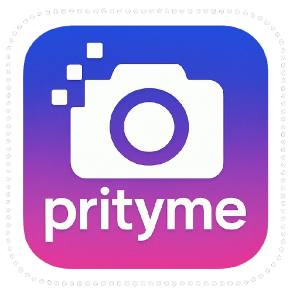

# prityme

<div align="center">

   
   
**prityme is a utility tool for images. It helps user to resize, compress and remove background of images like objects, portraits and more.**

  [](https://github.com/sujalnegi/prityme)
  [](https://moonshot.hackclub.com/)
[](https://hackatime-badge.hackclub.com/U09FLTYE9FF/prityme)

</div>

---

<div align="center">
  <a href="https://moonshot.hackclub.com" target="_blank">
    
  </a>
</div>

---

## Features

1. Backgound Remover

- Used Rembg python library(U²-Net model).

- detects background automatically 

- works best with objects & portraits

2. Image Compressor

- choose format jpg, png, webP.

- adjust quality, alpha(transparency selection.)

- compression is handled entirely in browser

3. Image Resizer

- resize by:

    - exact height/weight
    
    - or percentage

- keeps the original aspect ratio

- generates output using canvas

---

## Demo

A demo video showcasing all features locally can be added [here](https://drive.google.com/file/d/1vq_gTDREQuPvYqK-P80bOUdwTuGIkflX/view?usp=drive_link)

### Playable URL

[Here](https://prityme.pythonanywhere.com/)

---

## Technologies Used

### Backend

- Python v3.11

- Flask

- Rembg (U²-Net background removal)

- Pillow (image processing)

### Frontend

- HTML5, CSS3, JavaScript

- Canvas API (compression & resizing)

- Custom animations + gradients

- Material Icons

- Glass UI components


### Local Setup & Installation

1. Prerequisites

- Python 3.8+

- Pip

2. Clone the repository

```bash
git clone https://github.com/sujalnegi/prittyme.git
cd prittyme
```

3. Create a Virtual Environment

- Windows:
```bash
python -m venv venv
venv\Scripts\activate
```

- macOS/ Linux:
```bash
python3 -m venv venv
source venv/bin/activate
```

4. Install Dependencies

```bash
pip install flask rembg pillow
```

5. Run the Application

```bash
python app.py
```

Open in your browser:

```cpp
http://127.0.0.1:5000/
```

Prityme should be on your browser now.

---

## How to Use

1. Open the homepage and choose a feature (Compress / Resize / Background Remove).

2. Upload or drag & drop an image

3. Adjust settings

4. Click on the green button

5. Click on donwload and save the image or Preview to check first.

6. Click on the red Reset button to work with another image.

---

## Author

Sujal Negi

Email: [sujal1negi@gmail.com](mailto:sujal1negi@gmail.com)

Instagram: @[__sujalnegi_ _](https://www.instagram.com/_sujalnegi_/)

---
